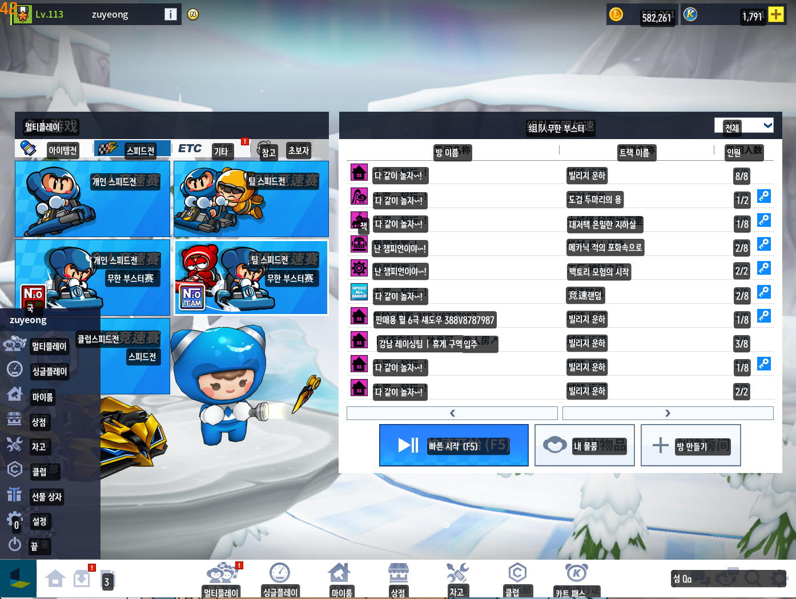
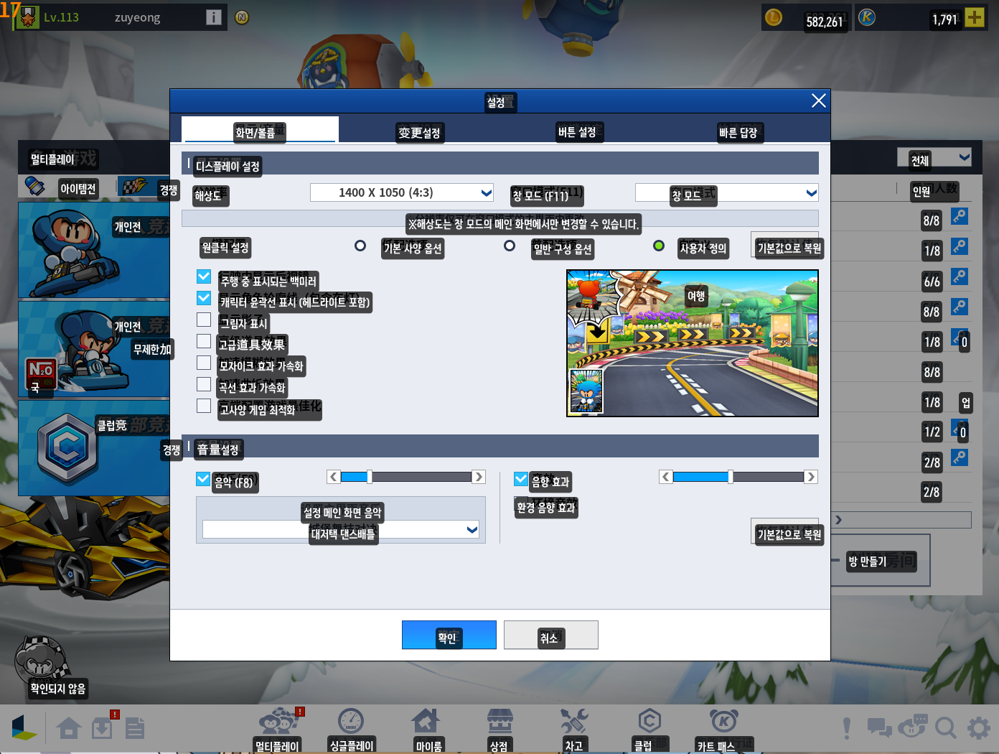
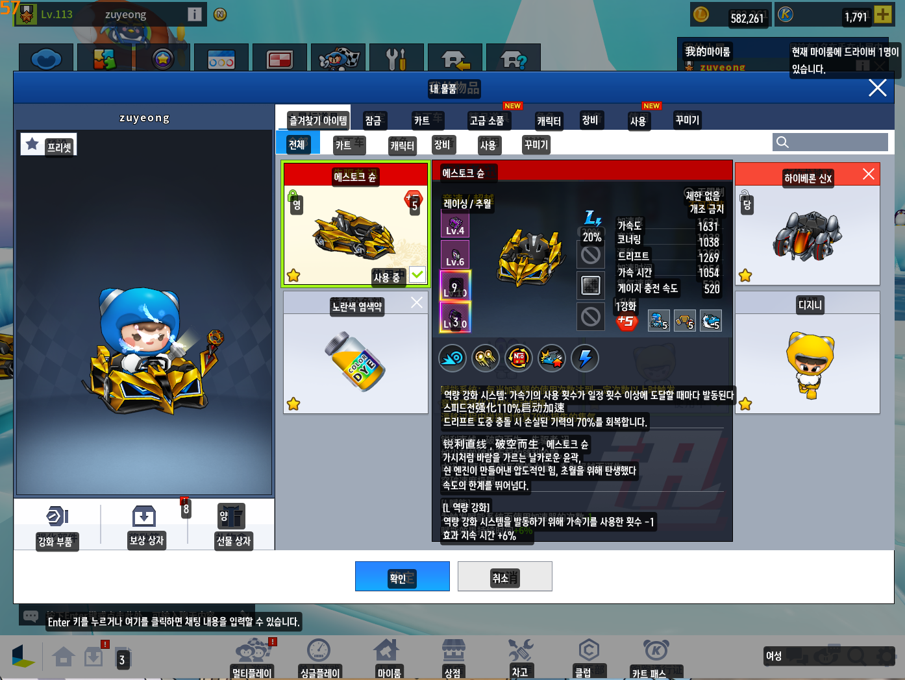

# 중카 번역기

중국 카트라이더를 위한 Windows 실시간 OCR 번역기입니다. 게임 창의 채팅과 UI 문구를 읽어 한국어로 번역하고, 결과를 별도 창 또는 게임 위 화면 오버레이로 표시합니다.

[최신 버전 다운로드](https://github.com/kwon1h/jung-ka-translator/releases/latest)

## 한눈에 보기

- 채팅 번역과 전체화면 번역을 상황에 맞게 전환합니다.
- OCR이 인식한 위치에 번역을 표시합니다. 번역끼리 겹쳐도 원래 위치를 유지합니다.
- 여러 번역 영역과 제외 영역을 게임 미리보기에서 편집할 수 있습니다.
- 유저 사전으로 게임 용어·닉네임·문구를 원하는 한국어 표현으로 우선 번역합니다.
- 화면 오버레이, 별도 결과 창, 방송·화면 공유 표시를 지원합니다.
- Windows OCR과 PaddleOCR(OpenVINO), DeepL·Google 번역 방식을 선택할 수 있습니다.

## 스크린샷

### 메인 화면

방 목록, 메뉴, 버튼 등 게임 메인 화면의 OCR 결과를 같은 위치에 오버레이로 표시합니다.



### 설정 화면

설정 창처럼 문장이 밀집한 화면도 각 OCR 항목의 위치를 기준으로 번역합니다.



### 내 아이템 화면

카트·아이템 이름과 상세 설명까지 필요한 영역을 화면 위에서 바로 읽을 수 있습니다.



## 설치

1. [Releases](https://github.com/kwon1h/jung-ka-translator/releases)에서 최신 `GameOverlayTranslator.exe`를 다운로드합니다.
2. 원하는 폴더에 파일을 둡니다.
3. `GameOverlayTranslator.exe`를 실행합니다.

별도 설치가 필요 없는 단일 실행 파일입니다. 처음 실행할 때 Windows SmartScreen 경고가 표시되면 `추가 정보`에서 실행할 수 있습니다.

## 빠른 시작

1. 카트라이더를 창모드 또는 테두리 없는 전체화면으로 실행합니다.
2. 중카 번역기에서 게임 창을 선택합니다.
3. 상단에서 `채팅 번역` 또는 `전체화면 번역`, 그리고 결과 표시 방식을 고릅니다.
4. `영역 편집`에서 번역할 영역을 지정합니다.
   - 좌클릭 드래그: 번역 영역 추가
   - 우클릭 드래그: 제외 영역 추가
   - 기존 영역 드래그: 위치·크기 수정
   - `Delete`: 선택한 영역 삭제
5. OCR 엔진·번역 언어를 확인하고 `번역 시작`을 누릅니다.

독점 전체화면에서는 외부 오버레이 창이 보이지 않을 수 있으므로 창모드 또는 테두리 없는 전체화면을 권장합니다.

## 유저 사전: 원하는 화면을 드래그해 직접 번역 만들기

반복해서 나오는 게임 용어, 아이템 이름, 닉네임, 버튼 문구는 유저 사전에 등록하면 원하는 한국어 표현을 우선 적용할 수 있습니다.

1. 왼쪽 `사전` 탭에서 `화면 OCR`을 누릅니다.
2. 게임 미리보기에서 번역본을 만들 원문을 좌클릭으로 드래그합니다.
3. `OCR 실행`을 누르면 선택한 영역의 원문이 자동으로 입력됩니다.
4. `대체 번역어`에 원하는 한국어 표현을 작성하고, 분류를 고른 뒤 `사전 단어 추가`를 누릅니다.

이후 같은 원문이 인식되면 등록한 표현이 우선 적용됩니다. 기본 사전도 추가·삭제·관리할 수 있습니다.

## 주요 기능

| 기능 | 내용 |
| --- | --- |
| 번역 모드 | 채팅 번역, 전체화면 번역 |
| 영역 편집 | 복수 번역 영역, 제외 영역, 드래그 이동·크기 조절 |
| 표시 방식 | 화면 오버레이, 별도 결과 창 |
| OCR | Windows OCR, PaddleOCR(OpenVINO) |
| 번역 서비스 | DeepL API, Google 번역 방식 |
| 오버레이 스타일 | 글꼴, 글자 크기, 테두리, 배경, 투명도, 표시 시간 |
| 유저 사전 | 직접 입력 또는 화면 OCR 드래그로 원문을 채워 원하는 번역 등록 |

## 방송·화면 공유

`화면 공유/방송 시 오버레이 표시`를 켜면 모니터·디스플레이 캡처에 번역 오버레이를 포함할 수 있습니다. OBS·Discord 등에서 게임 창만 직접 캡처하는 방식은 별도 오버레이 창을 합성하지 않을 수 있으므로, 이 경우 모니터/디스플레이 캡처를 사용하세요.

## 상세 문서

- [기능 가이드](docs/FEATURES.md)
- [번역 모드](docs/features/번역모드.md)
- [OCR 엔진](docs/features/OCR엔진.md)
- [번역 서비스](docs/features/번역서비스.md)
- [유저 사전](docs/features/유저사전.md)
- [빌드 가이드](docs/BUILD.md)

## 개발

```powershell
.\.dotnet\dotnet.exe build src\GameOverlayTranslator.App\GameOverlayTranslator.App.csproj
.\.dotnet\dotnet.exe run --project tests\GameOverlayTranslator.RegressionTests\GameOverlayTranslator.RegressionTests.csproj
.\scripts\build-release.ps1
```

## License

[MIT License](LICENSE)
