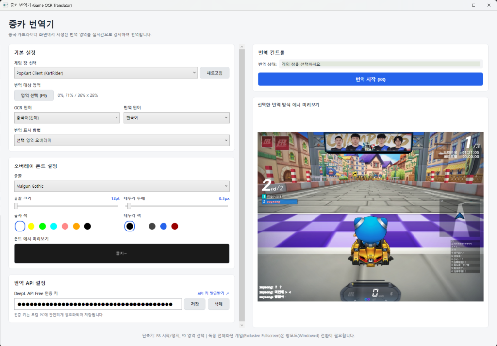
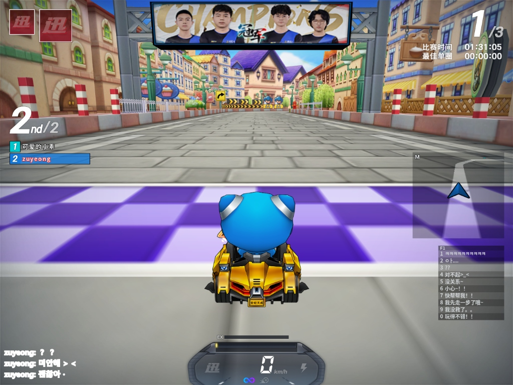
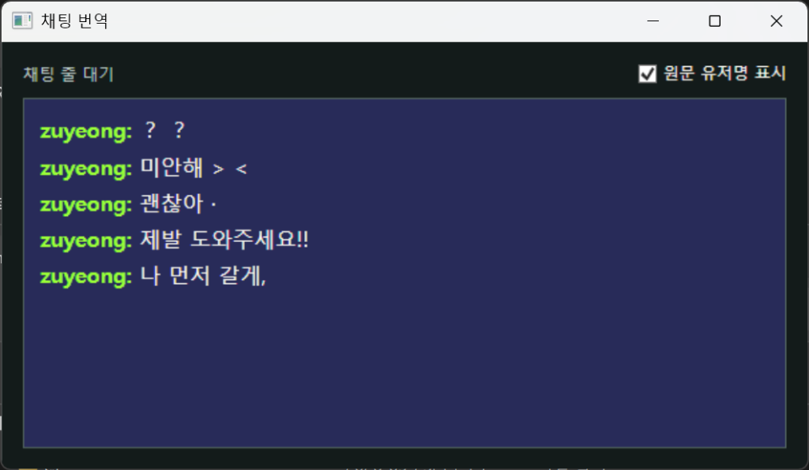

# 중카 번역기 - 중국 카트라이더 실시간 채팅 OCR 번역기 (Game Overlay Translator)

> **중국 카트라이더(중카) 전용 실시간 화면 OCR 및 DeepL 기반 번역 프로그램**
> 
> 게임 화면의 채팅 영역을 실시간으로 캡처 및 분석하여 번역한 뒤, 게임 화면 위에 자막처럼 깔끔한 투명 오버레이로 띄워주거나 별도의 결과 창에 표시해 주는 Windows 데스크톱 프로그램입니다. 목표는 게임 채팅처럼 짧고 반복되는 문장을 빠르게 처리하고, API 사용량을 낭비하지 않는 실시간 번역 흐름입니다.

---

## 📌 목차 (Table of Contents)
- [🖥️ UI 스크린샷 (UI Screenshots)](#%EF%B8%8F-ui-%EC%8A%A4%ED%81%AC%EB%A6%B0%EC%83%B7-ui-screenshots)
- [✨ 주요 기능 및 특징 (Features & Key Characteristics)](#-주요-기능-및-특징-features--key-characteristics)
- [🚀 다운로드 및 실행 방법](#-다운로드-및-실행-방법)
- [🛠️ 실행 전 필수 설정 (Prerequisites)](#%EF%B8%8F-실행-전-필수-설정-prerequisites)
- [📖 사용 방법](#-사용-방법)
- [🛡️ 번역 품질 및 API 사용 정책 (Translation Quality & API Policy)](#%EF%B8%8F-번역-품질-및-api-사용-정책-translation-quality--api-policy)
- [📕 사용자 사전 (User Dictionary)](#-사용자-사전-user-dictionary)
- [🔍 로그 및 디버깅 (Logs & Debugging)](#-로그-및-디버깅-logs--debugging)
- [⚠️ 제한 사항 (Limitations)](#%EF%B8%8F-제한-사항-limitations)
- [❓ 자주 묻는 질문 (FAQ)](#-자주-묻는-질문-faq)
- [📄 개발 문서 (Development Documents)](#-개발-문서-development-documents)
- [💻 빌드 및 개발 (For Developers)](#-빌드-및-개발-for-developers)
- [📜 라이선스 (License)](#-라이선스-license)

---

## 🖥️ UI 스크린샷 (UI Screenshots)

### 1. 메인 설정 및 스타일 커스터마이징 화면
설정 창 내에서 글자 크기, 외곽선(테두리) 두께, 자막 색상, 테두리 색상을 미려한 슬라이더와 원형 색상 팔레트로 자유롭게 설정할 수 있으며 예시 텍스트("즐카~")로 즉시 미리볼 수 있습니다.


### 2. 선택 영역 오버레이 번역 모드 (인게임 채팅창 투명 자막)
게임 화면 위에 투명창을 덧씌우는 방식으로, 5초 동안만 자막이 표시되고 오래된 메시지는 위로 밀려나며 자동으로 소멸합니다. 게임 화면 바깥 테두리선이나 간섭 없이 깔끔하게 표시됩니다.


### 3. 별도 결과 창 모드 (투명도 조절형 자막 창)


---

## ✨ 주요 기능 및 특징 (Features & Key Characteristics)

### 核心 특징 (Core Features)
* **실시간 자막 오버레이**: 게임 화면 위에 투명창을 얹어, 검은 외곽선이 포함된 흰색 글씨(시인성 극대화)로 실시간 번역본을 보여줍니다.
* **Windows 내장 OCR 사용**: 별도의 무거운 외부 엔진 없이 Windows 10/11 기본 OCR 엔진(`Windows.Media.Ocr`)을 활용하여 가볍고 빠르게 문자를 추출합니다.
* **DeepL 번역 연동**: 최고 품질의 DeepL API(무료/유료 플랜 지원)를 연동하여 번역을 수행합니다. API 키는 Windows DPAPI로 안전하게 암호화되어 개인 PC 내에 저장됩니다.
* **채팅 최적화 필터 및 중복 제거**:
  * **중복/유사 채팅 필터링**: 화면이 갱신될 때마다 동일한 대화가 중복 번역되어 API 할당량을 낭비하지 않도록 Jaccard 유사도 기반으로 걸러냅니다.
  * **OCR 오타 보정 및 교체**: 이전 프레임에서 글자가 일부 깨져서 번역되었다가, 이후 프레임에서 온전하게 인식되면 기존 번역본을 더 높은 품질의 결과로 교체(Replace)합니다.
  * **다중 라인 분할**: Windows OCR이 여러 줄의 채팅을 하나의 라인으로 뭉쳐서 인식할 때, 이를 유저별(`유저명: 메시지`)로 파싱하여 쪼개어 번역합니다.
  * **노이즈 필터**: 의미 없는 특수문자나 OCR 인식 오류로 생긴 노이즈 덩어리는 번역 요청에서 제외합니다.

### 전체 기능 목록 (Full Feature List)
- 실행 중인 게임 창 선택
- 선택한 게임 창 기준 채팅 영역 드래그 지정
- Windows OCR 기반 중국어 간체/일본어 인식
- DeepL API Free 기반 한국어 번역
- 게임 영역 위 선택 영역 오버레이 표시
- 27인치 FHD 기준 가독성 프리셋
- 별도 결과 창 표시
- 게임 고정 UI/채팅 문구용 사용자 사전
- 카테고리별 사용자 사전 관리
- 동일/유사 채팅 중복 필터
- 세션 단위 API 요청량 표시
- 마지막 선택 창과 영역 자동 복원
- 진단 로그와 수동 OCR 파서 테스트

---

## 🚀 다운로드 및 실행 방법

본 프로그램은 설치 과정이 전혀 필요 없는 **단일 실행 파일(Portable)**로 제공됩니다.

1. [GitHub Releases](https://github.com/kwon1h/jung-ka-translator/releases) 페이지로 이동합니다.
2. 가장 최신 버전의 **`GameOverlayTranslator-win-x64.zip`** 파일을 다운로드합니다.
3. 압축을 원하는 안전한 경로에 해제합니다.
4. 폴더 내의 **`GameOverlayTranslator.App.exe`**를 실행하면 즉시 시작됩니다.

---

## 🛠️ 실행 전 필수 설정 (Prerequisites)

> [!IMPORTANT]
> 프로그램이 정상 작동하려면 다음 두 가지 사전 설정이 반드시 완료되어야 합니다.

### 1. Windows OCR 언어 팩 설치
중국어 또는 일본어 화면을 인식하려면 Windows OS 자체에 해당 언어 팩이 깔려 있어야 합니다.

1. Windows **설정** (`Win + I`) -> **시간 및 언어** 메뉴로 이동합니다.
2. **언어 및 지역**을 선택합니다.
3. **언어 추가** 버튼을 눌러 번역할 언어(예: 중국어 간체 `中文(简体, 중국)`, 일본어 `日本語`)를 추가합니다.
4. 설치 시 **언어 팩(Language Pack)** 또는 **기본 입력/텍스트 음성 변환(Basic typing)** 항목이 체크되었는지 확인하고 설치를 완료합니다.
5. (설치 완료 후 프로그램을 켜두었다면 재시작해 주세요.)

### 2. DeepL API 키 발급 및 입력
실시간 번역 API 호출을 위해 DeepL API 키가 필요합니다.

1. [DeepL API 등록 페이지](https://www.deepl.com/pro-api)에 접속하여 회원 가입을 진행합니다. (무료 플랜인 'DeepL API Free'를 선택하시면 매월 50만 자까지 무료 번역이 가능합니다. 가입 시 본인 인증을 위해 카드를 등록하지만 요금은 청구되지 않습니다.)
2. 가입 완료 후, [DeepL API 키 관리 페이지 (https://www.deepl.com/ko/your-account/keys)](https://www.deepl.com/ko/your-account/keys)에 접속합니다.
3. 페이지 하단의 **API 인증 키(Authentication Key)** 목록에서 키를 복사합니다.
4. 중카 번역기 프로그램 메인 화면에서 복사한 키를 붙여넣은 후 **저장** 버튼을 누릅니다.

API 키는 Windows DPAPI로 현재 사용자 범위에 암호화 저장됩니다. 저장 위치는 `%LocalAppData%\GameOverlayTranslator\deepl-free-auth.key`입니다.

---

## 📖 사용 방법

1. 대상 게임 실행 (테두리 없는 창 모드 혹은 창 모드 권장)
2. 번역기에서 대상 '게임 창' 선택 (드롭다운 목록)
3. '영역 지정' 버튼 클릭 (혹은 F9 단축키) ➡️ 게임의 채팅창 영역을 드래그하여 지정
4. 원본 OCR 언어 선택 (기본값: 중국어 간체)
5. 표시 방식 및 가독성 프리셋 선택
   - `선택 영역 오버레이`: 게임 채팅 영역 위에 번역문 표시
   - `별도 결과 창`: 독립 창에 채팅 결과 표시
6. 오버레이를 쓴다면 가독성 프리셋을 선택합니다.
   - `기본`: 검은 반투명 배경 + 흰 글씨
   - `강조`: 진한 배경 + 노란 글씨
   - `원문 보호`: 배경 없이 흰 테두리 중심
   - `밝은 배경용`: 밝은 게임 화면용 진한 배경
   - `어두운 배경용`: 어두운 게임 화면용 밝은 배경
7. '시작' 버튼 클릭 (혹은 F8 단축키) ➡️ 실시간 오버레이 번역 작동!

### 단축키
- `F8`: 번역 시작/정지
- `F9`: 영역 다시 선택

### 💡 유용한 팁
* **화면 모드 전환**: 번역 결과창 하단에서 '결과창 모드'와 '오버레이 모드'를 토글할 수 있습니다.
* **단축키 활용**: 게임 플레이 중 `F8` 키로 실시간 번역을 시작/정지할 수 있고, 채팅창 위치가 바뀌었을 때는 `F9` 키를 눌러 바로 다시 영역을 그릴 수 있습니다.
* **모듈 테스터**: 메인 창의 `모듈 테스터` 버튼을 누르면 창 캡처, OCR 단독 인식, DeepL 번역 기능이 개별적으로 정상 작동하는지 디버깅해볼 수 있습니다.

---

## 🛡️ 번역 품질 및 API 사용 정책 (Translation Quality & API Policy)

이 앱은 게임 채팅 특성상 사전을 우선합니다.

- 사용자 사전에 정확히 일치하는 문장은 DeepL로 보내지 않습니다.
- 동일한 OCR 문장은 세션 내에서 다시 번역하지 않습니다.
- 같은 유저의 유사 채팅은 최근 캐시로 걸러 API 호출을 줄입니다.
- 번역 품질이 낮은 OCR 결과는 번역하지 않고 필터링하거나 OCR 원문만 표시합니다.
- 번역 실패 시 앱이 종료되지 않고 원문 또는 사전 치환 결과를 표시합니다.

### 현재 정책과 주의점:
- 사전 부분 치환 후 중국어/일본어가 남지 않은 문장은 DeepL로 보내지 않습니다.
- 화면 번역 실험 모드는 문장 단위가 아니라 UI 텍스트 단위라 API 사용량이 늘 수 있습니다. v1 기본 목표는 채팅 번역입니다.

---

## 📕 사용자 사전 (User Dictionary)

기본 사전은 다음 범주로 관리합니다.
- 게임 UI 고정어
- 채팅 빠른 답장
- 트랙/모드명
- 아이템/차량 용어

앱 실행 시 기본 사전은 `%LocalAppData%\GameOverlayTranslator\user_dictionary.csv`에 병합됩니다. 사용자가 직접 추가한 항목은 유지됩니다.

CSV 컬럼은 `Source,Target,Category` 순서입니다. 기존 `%LocalAppData%\GameOverlayTranslator\user_dictionary.json` 파일만 있는 경우 첫 실행 때 CSV로 자동 이전됩니다.

사전 탭에서 새 항목을 추가할 때 분류를 함께 지정할 수 있습니다.

---

## 🔍 로그 및 디버깅 (Logs & Debugging)

로그 위치:
```text
%LocalAppData%\GameOverlayTranslator\logs\
```

진단 로그 탭에서는 최근 OCR 원문, 파서 결과, 필터 규칙, 필터 이유를 확인할 수 있습니다. 수동 OCR 텍스트 테스트에는 다음 형식의 샘플을 넣어 파서와 필터를 확인할 수 있습니다.
```text
zuyeong: 快使用天使!
```

---

## ⚠️ 제한 사항 (Limitations)

- v1은 단일 게임 창과 단일 채팅 영역을 기준으로 합니다.
- 독점 전체 화면은 지원 대상이 아닙니다. 창모드 또는 전체창모드를 사용해야 합니다.
- Windows OCR 품질은 게임 해상도, 글자 크기, 배경 투명도, 언어팩 설치 상태에 영향을 받습니다.
- 오버레이는 OCR 캡처 피드백을 줄이기 위해 캡처 직전 숨김 처리를 사용합니다.

---

## ❓ 자주 묻는 질문 (FAQ)

### Q1. 중카 번역기가 정상적으로 작동하지 않거나 화면 캡처가 안 됩니다.
* **A.** 대상 게임(중국 카트라이더 등)이 **창 모드** 또는 **테두리 없는 창 모드(Borderless window)**로 실행 중인지 확인하세요. 전체 화면 모드에서는 Direct3D 독점으로 인해 화면 캡처 및 투명 오버레이 레이어가 작동하지 않을 수 있습니다.
* **A.** 프로그램 실행 시 **관리자 권한**으로 실행해 보세요. 일부 게임 보안 프로그램이 일반 권한 프로세스의 화면 캡처 또는 키 입력을 차단할 수 있습니다.

### Q2. OCR 인식 결과가 엉뚱하게 나오거나 번역이 끊깁니다.
* **A.** Windows의 **중국어(간체) 언어 팩**이 설치되어 있는지 다시 한번 확인해 주세요. 언어 팩이 누락되면 기본 영어 OCR이 적용되어 한자가 외계어로 표시될 수 있습니다. (자세한 설정 방법은 [실행 전 필수 설정](#1-windows-ocr-%EC%96%B8%EC%96%B4-%ED%8C%A9-%EC%84%A4%EC%B9%98)을 참고하세요.)

### Q3. 번역 자막의 글씨체, 색상, 테두리를 변경하고 싶습니다.
* **A.** 메인 설정 창의 **오버레이 폰트 설정** 카드에서 실시간으로 글꼴 크기, 테두리(외곽선) 두께, 자막 색상, 테두리 색상을 커스터마이징할 수 있습니다. 슬라이더와 원형 색상 팔레트를 조작하면 하단의 예시 텍스트("즐카~")에 즉시 반영되며, 실제 게임 오버레이 화면에도 즉시 실시간 동기화됩니다.

---

## 📄 개발 문서 (Development Documents)

- [개발 가이드라인](guideline.md)
- [실패 원인 분석](docs/failure-analysis.md)

---

## 💻 빌드 및 개발 (For Developers)

이 앱은 `.NET 8.0` 및 `Windows 10 SDK (10.0.19041)` 환경을 타겟팅합니다. 로컬 빌드 및 실행은 다음과 같이 진행합니다.

```powershell
# NuGet 의존성 복구
dotnet restore GameOverlayTranslator.sln --configfile NuGet.Config

# 솔루션 빌드
dotnet build GameOverlayTranslator.sln --configfile NuGet.Config

# 프로젝트 로컬 실행
dotnet run --project src\GameOverlayTranslator.App\GameOverlayTranslator.App.csproj

# 회귀 테스트 로컬 실행
dotnet run --project tests\GameOverlayTranslator.RegressionTests\GameOverlayTranslator.RegressionTests.csproj
```

이 저장소에는 로컬 .NET SDK가 포함될 수 있습니다. 이 경우 기존 작업 방식에 맞춰 `.dotnet\dotnet`을 사용합니다.

---

## 📜 라이선스 (License)

이 프로젝트는 **MIT 라이선스**하에 배포됩니다. 자세한 내용은 [LICENSE](LICENSE) 파일을 참조하세요.
