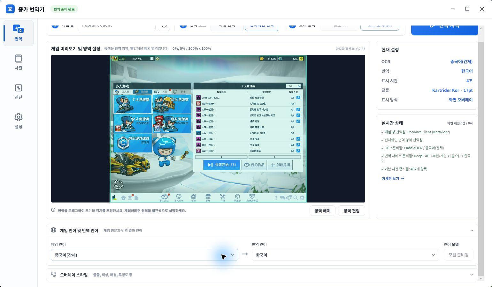

# 기능 가이드

중카 번역기는 선택한 게임 창을 읽어 채팅과 UI 문구를 번역하고, 별도 창 또는 원문 위치의 화면 오버레이로 표시합니다. 이 문서는 실제 화면의 기능별 사용법으로 이동하기 위한 목차입니다.

## 문서 목차

| 기능 | 상세 문서 | 주요 구역 |
| --- | --- | --- |
| 번역 모드 | [번역모드.md](features/번역모드.md) | [채팅 번역](features/번역모드.md#채팅-번역), [전체화면 번역](features/번역모드.md#전체화면-번역), [영역 편집](features/번역모드.md#영역-편집), [표시 방식](features/번역모드.md#표시-방식) |
| 언어 모델 | [OCR엔진.md](features/OCR엔진.md) | [게임 언어](features/OCR엔진.md#게임-언어와-모델), [모델 준비](features/OCR엔진.md#모델-준비), [품질 높이기](features/OCR엔진.md#ocr-품질을-높이는-방법) |
| 번역 서비스 | [번역서비스.md](features/번역서비스.md) | [DeepL API](features/번역서비스.md#deepl-api-추천), [사용량 확인](features/번역서비스.md#deepl-사용량-확인), [Google 비공식 API](features/번역서비스.md#google-번역-비공식-api), [Google Apps Script](features/번역서비스.md#google-apps-script) |
| 유저 사전 | [유저사전.md](features/유저사전.md) | [직접 추가](features/유저사전.md#직접-추가), [화면 OCR로 채우기](features/유저사전.md#화면-ocr로-채우기), [저장 위치](features/유저사전.md#저장-위치), [운영 팁](features/유저사전.md#운영-팁) |

## 빠른 선택 기준

- 채팅만 읽으려면 [채팅 번역](features/번역모드.md#채팅-번역)을, 화면 UI까지 읽으려면 [전체화면 번역](features/번역모드.md#전체화면-번역)을 사용하세요.
- 모델 버튼이 `모델 준비됨`이면 바로 시작할 수 있습니다. 다운로드가 필요하면 [모델 준비](features/OCR엔진.md#모델-준비)를 확인하세요.
- 반복 표현이나 게임 용어는 [유저 사전](features/유저사전.md)에 등록해 API 호출과 오역을 줄이세요.

## 관련 문서

- [빌드 가이드](BUILD.md)
- [기본 유저 사전 원본](user_dictionary.csv)
