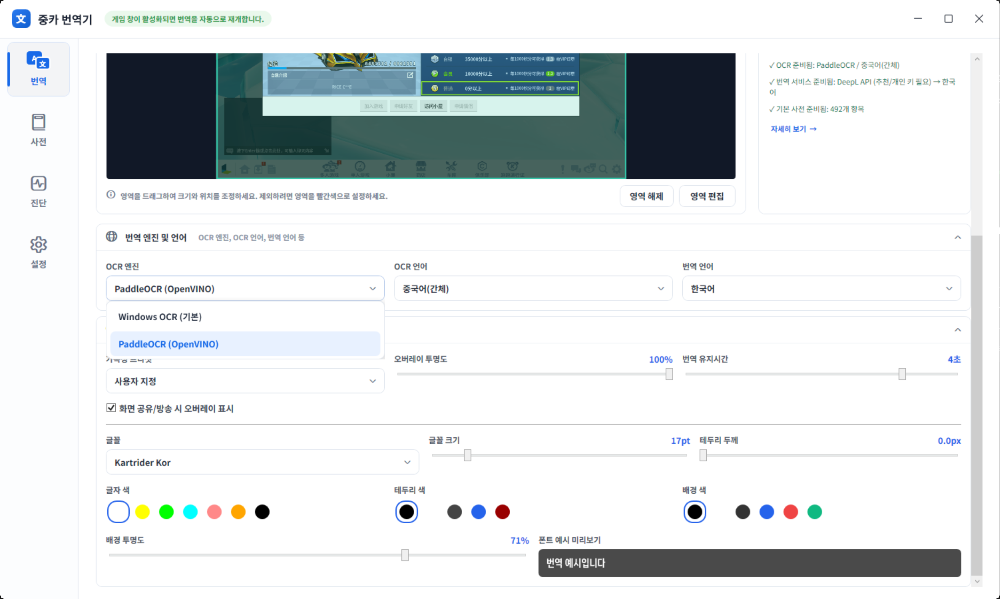

# OCR 엔진

중카 번역기는 게임 화면의 글자를 읽을 때 `PaddleOCR(OpenVINO)`만 사용합니다. 엔진을 고르는 대신, 원문 언어와 번역 언어만 선택하면 됩니다.



## PaddleOCR(OpenVINO)

PaddleOCR은 중국어(간체)와 일본어 게임 UI·채팅을 읽기 위해 포함한 OCR 엔진입니다. Windows에 중국어 또는 일본어 OCR 언어 팩을 설치할 필요가 없습니다.

1. 번역 화면에서 `번역 엔진 및 언어`를 엽니다.
2. `OCR 언어`를 게임 원문에 맞춰 `중국어(간체)` 또는 `일본어`로 선택합니다.
3. `번역 언어`를 선택합니다.
4. 번역을 시작합니다.

OCR 엔진 표시는 읽기 전용 `PaddleOCR (OpenVINO)`입니다. 이전 버전의 Windows OCR 선택지는 더 이상 제공하지 않습니다.

## 모델 준비

첫 OCR 실행에는 언어별 PaddleOCR 모델을 내려받고 로드하는 시간이 걸릴 수 있습니다. 이는 Windows 언어 팩과 별개의 앱 모델 준비 과정입니다.

자동 다운로드가 실패하거나 네트워크가 제한된 환경이라면 아래 스크립트로 미리 준비할 수 있습니다.

```powershell
.\scripts\download-models.ps1
```

스크립트는 PaddleOCR 모델을 `%APPDATA%\paddleocr-models` 아래에 준비합니다. 이후 앱은 선택한 OCR 언어에 맞는 모델을 사용합니다.

## OCR 품질을 높이는 방법

- 번역 영역을 글자 주변으로 좁힙니다.
- 움직이는 배경, 반투명 UI, 효과가 많은 영역은 제외 영역으로 지정합니다.
- 작은 글자는 오버레이 글꼴 크기와 별개이므로, OCR 대상 영역을 가능한 한 정확히 잡습니다.
- 밝은 글자와 어두운 배경처럼 대비가 높은 화면에서 인식률이 좋아집니다.
- 반복해서 잘못 읽히는 이름·용어는 [유저 사전](유저사전.md)에 등록해 원하는 번역을 우선 적용합니다.

## 성능 참고

- 전체화면 번역은 넓은 화면을 읽으므로 채팅 번역보다 처리량이 큽니다.
- 지연이 크면 필요한 번역 영역만 남기고, 고정 장식이나 움직임이 많은 부분은 제외 영역으로 추가하세요.
- 중국어 텍스트가 없는 화면은 오버레이에 번역을 표시하지 않습니다.
