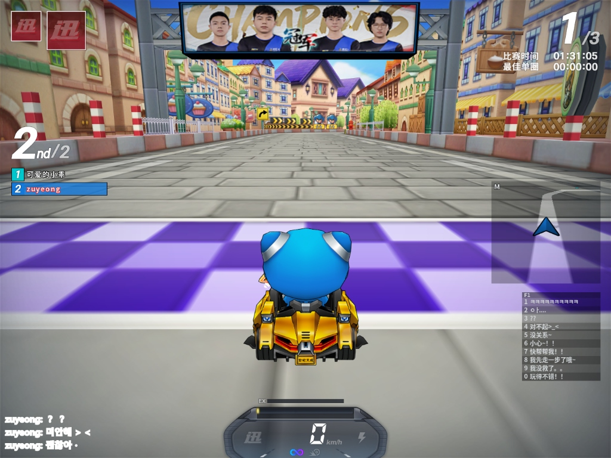

# 번역 모드

중카 번역기는 같은 화면 캡처 기능을 쓰지만, 텍스트를 해석하는 방식에 따라 `채팅 번역`과 `전체화면 번역`으로 나뉩니다.

## 전체 흐름

1. 게임을 창모드 또는 테두리 없는 전체화면으로 실행합니다.
2. 앱에서 번역할 게임 창을 선택합니다.
3. `채팅 번역` 또는 `전체화면 번역`을 선택합니다.
4. 필요한 경우 `영역 선택`으로 OCR 범위를 지정합니다.
5. 필요 없는 텍스트가 계속 잡히면 `제외 영역 선택`을 추가합니다.
6. OCR 엔진과 번역 서비스를 확인한 뒤 `번역 시작`을 누릅니다.

독점 전체화면에서는 오버레이가 게임 위에 표시되지 않을 수 있습니다. 게임 설정에서 창모드 또는 테두리 없는 전체화면을 사용하세요.

## 채팅 번역

채팅창처럼 일정한 위치에 쌓이는 대화를 번역하는 모드입니다.

### 언제 사용하나

- 중국 카트라이더 채팅을 한국어로 읽고 싶을 때
- 대화 영역이 화면의 한쪽에 고정되어 있을 때
- 닉네임과 메시지를 구분해서 보고 싶을 때

### 설정 방법

1. `번역 모드`에서 `채팅 번역`을 선택합니다.
2. `영역 선택`을 누릅니다.
3. 게임 화면에서 채팅 줄이 나타나는 영역만 드래그합니다.
4. OCR 언어를 `중국어(간체)` 또는 `일본어`로 맞춥니다.
5. 번역 언어가 `한국어`인지 확인합니다.
6. `번역 시작`을 누릅니다.

### 동작 방식

- OCR 결과에서 `플레이어: 메시지` 형태의 줄을 찾습니다.
- 플레이어명은 유지하고 메시지 부분만 번역 대상으로 사용합니다.
- 너무 짧은 메시지, 의미 없는 노이즈, 최근에 반복된 메시지는 번역 요청을 줄이기 위해 필터링합니다.
- 유저 사전에 정확히 일치하는 표현이 있으면 번역 API를 호출하지 않고 사전의 한국어 표현을 사용합니다.

### 주의할 점

- 채팅 영역에 배경 장식이나 다른 UI가 많이 들어가면 OCR이 불안정해질 수 있습니다.
- 닉네임과 메시지가 잘리지 않도록 채팅 줄 전체를 포함해 선택하세요.
- 같은 채팅이 반복해서 보이면 중복 필터와 캐시 때문에 API 사용량이 늘지 않을 수 있습니다.

## 전체화면 번역

게임 화면의 안내 문구, 시스템 메시지, UI 텍스트처럼 채팅이 아닌 텍스트를 번역하는 모드입니다.

### 언제 사용하나

- 채팅이 아니라 화면 안내 문구를 읽고 싶을 때
- 맵/레이스 UI, 시스템 메시지, 짧은 화면 문구를 번역하고 싶을 때
- 텍스트 위치에 맞춰 오버레이 번역을 띄우고 싶을 때

### 설정 방법

1. `번역 모드`에서 `전체화면 번역`을 선택합니다.
2. 특정 영역만 번역하려면 `영역 선택`을 누르고 원하는 범위를 드래그합니다.
3. 영역을 선택하지 않으면 선택한 게임 창 전체가 번역 대상이 됩니다.
4. 계속 잡히는 닉네임, 순위표, 미니맵 텍스트가 있으면 `제외 영역 선택`으로 제외합니다.
5. `번역 시작`을 누릅니다.

### 동작 방식

- OCR 라인의 위치를 기준으로 번역 결과를 배치합니다.
- 같은 문구가 반복되면 화면 번역 캐시를 사용해 번역 API 호출을 줄입니다.
- 유저 사전 항목은 전체화면 번역에서도 먼저 적용됩니다.
- 선택 영역이 있으면 제외 영역도 게임 창 기준 좌표에서 선택 영역 안쪽으로 맞춰 처리됩니다.

## 영역 선택과 제외 영역

영역 선택은 OCR 품질과 번역 비용에 직접 영향을 줍니다.

### 영역 선택

- 글자 주변만 포함하고 움직이는 배경이나 장식 UI는 가능한 줄입니다.
- 채팅 번역은 채팅이 실제로 나오는 줄 전체를 포함합니다.
- 전체화면 번역은 번역이 필요한 화면 구역만 좁히면 OCR 시간과 번역 요청이 줄어듭니다.

### 제외 영역

- 닉네임, 순위표, 미니맵, 고정 UI처럼 번역할 필요가 없는 영역을 제외합니다.
- 제외 영역과 충분히 겹치는 OCR 라인만 제거합니다.
- 화면 전체를 제외하면 OCR 텍스트가 없는 것으로 처리되어 번역 API를 호출하지 않습니다.

## 표시 방식

| 표시 방식 | 설명 | 추천 상황 |
| --- | --- | --- |
| 별도 결과 창 | 번역 결과를 별도 창에 모아 표시합니다. | 채팅 번역을 안정적으로 읽고 싶을 때 |
| 선택 영역 오버레이 | 선택한 게임 영역 위에 번역 결과를 겹쳐 표시합니다. | 화면 문구 위치에 맞춰 보고 싶을 때 |

오버레이는 글꼴, 글자 크기, 색상, 테두리, 배경, 투명도를 조절할 수 있습니다. 밝은 배경과 어두운 배경에서 가독성이 달라지므로 `오버레이 가독성 프리셋`을 먼저 적용한 뒤 세부 값을 조정하는 것이 좋습니다.

## 문제 해결

| 증상 | 확인할 점 |
| --- | --- |
| 번역 결과가 안 보임 | 게임이 독점 전체화면인지 확인하고 창모드로 바꿉니다. |
| 엉뚱한 문구가 번역됨 | 영역을 더 좁히거나 제외 영역을 추가합니다. |
| 채팅이 파싱되지 않음 | 닉네임과 메시지가 함께 들어오도록 채팅 줄 전체를 선택합니다. |
| API 사용량이 예상보다 낮음 | 유저 사전, 중복 필터, 캐시가 적용된 경우 API 호출이 생략될 수 있습니다. |
