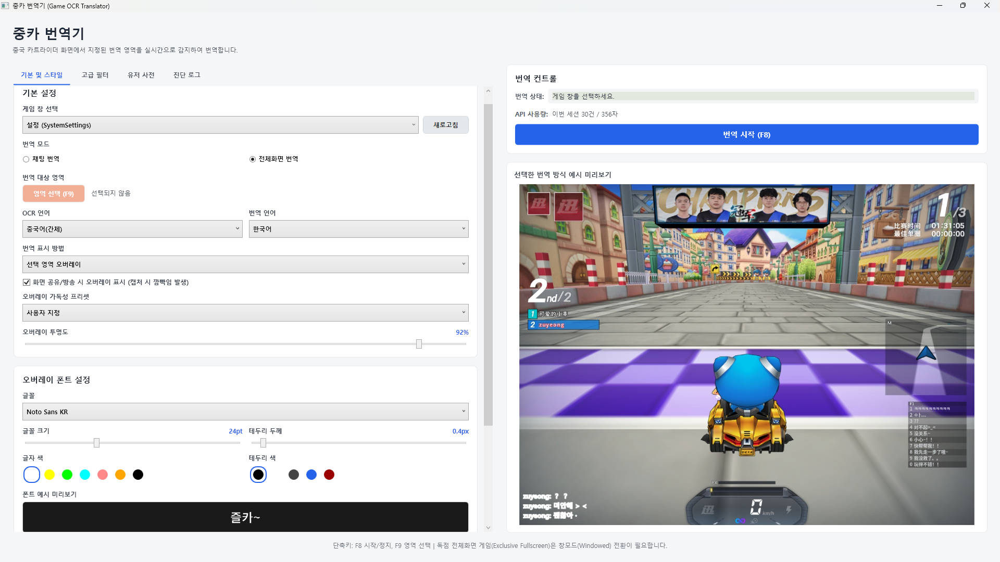

# 번역 서비스

번역 서비스는 OCR로 읽은 원문을 한국어로 바꾸는 단계입니다. 앱에서는 `DeepL API`, `Google 번역 비공식 API`, `Google Apps Script`를 선택할 수 있습니다.

## 빠른 선택 기준

| 서비스 | 추천도 | 특징 |
| --- | --- | --- |
| DeepL API | 높음 | 번역 품질이 좋아 기본 추천 옵션입니다. 개인 API 키가 필요합니다. |
| Google 번역 비공식 API | 보통 | API 키 없이 사용할 수 있지만 요청 제한이 걸릴 수 있습니다. |
| Google Apps Script | 보통 | 개인 웹 앱 URL을 직접 배포해 쓰는 방식입니다. |

## DeepL API 추천

가능하면 DeepL API를 사용하는 것을 권장합니다. 자연스러운 번역 품질이 필요한 채팅 번역과 화면 문구 번역에 가장 무난합니다.

### API 키 설정

1. DeepL 계정에서 API 키를 발급받습니다.
2. 앱의 번역 서비스 선택에서 `DeepL API (추천/개인 키 필요)`를 선택합니다.
3. `DeepL API Free 인증 키` 입력란에 키를 붙여 넣습니다.
4. `저장`을 누릅니다.

앱은 DeepL API 키를 현재 Windows 사용자 계정 기준으로 보호 저장합니다. 저장 위치는 `%LOCALAPPDATA%\GameOverlayTranslator\deepl-free-auth.key`입니다.

### DeepL 사용량 확인

DeepL API Free는 공식 문서 기준 월 500,000 characters per month 제한이 있습니다. 사용량은 번역 요청에 포함된 원문 문자 수 기준으로 계산됩니다.

- 사용량 확인: [DeepL usage page](https://www.deepl.com/ko/your-account/usage)
- API 제한 참고: [DeepL usage and limits](https://developers.deepl.com/docs/resources/usage-limits)

앱의 `API 사용량` 표시는 이번 앱 세션에서 번역 API로 보낸 요청 수와 문자 수를 보여 줍니다. DeepL 계정의 월간 사용량은 DeepL 계정 페이지에서 확인해야 합니다.

### 사용량을 줄이는 방법

- 번역 영역을 필요한 부분으로 좁힙니다.
- 제외 영역으로 닉네임, 순위표, 고정 UI를 제거합니다.
- 반복 표현은 유저 사전에 등록합니다.
- 전체화면 번역에서 같은 문구가 반복되면 캐시가 API 호출을 줄입니다.

## Google 번역 비공식 API

API 키 없이 사용할 수 있는 대안입니다.

### 장점

- 별도 계정이나 API 키 없이 바로 시도할 수 있습니다.
- 간단한 테스트나 임시 사용에 편합니다.

### 주의할 점

- 공식 유료 API가 아닌 비공식 엔드포인트를 사용합니다.
- 요청량이 많으면 일시적으로 제한될 수 있습니다.
- 안정성과 품질은 DeepL보다 예측하기 어렵습니다.

## Google Apps Script

사용자가 직접 Google Apps Script 웹 앱을 배포하고, 그 웹 앱 URL을 앱에 등록해 사용하는 방식입니다.

### 설정 흐름

1. 개인 Google 계정에서 Apps Script 프로젝트를 만듭니다.
2. 번역 요청을 처리하는 웹 앱으로 배포합니다.
3. 배포된 웹 앱 URL을 복사합니다.
4. 앱에서 `Google Apps Script (무료/개인 웹앱)`을 선택합니다.
5. `Google Apps Script 웹 앱 URL`에 붙여 넣고 저장합니다.

### 주의할 점

- 웹 앱 URL이 비어 있으면 번역 요청이 실패합니다.
- Apps Script 할당량과 배포 권한 설정에 영향을 받습니다.
- 개인이 배포한 웹 앱이므로 관리 책임은 사용자에게 있습니다.

## 오류가 날 때

| 증상 | 확인할 점 |
| --- | --- |
| DeepL 인증 키 오류 | 키를 다시 저장하고 앞뒤 공백이 없는지 확인합니다. |
| DeepL 사용량 초과 | DeepL 사용량 페이지에서 월간 character 사용량을 확인합니다. |
| Google 비공식 API 실패 | 요청 제한 가능성이 있으므로 잠시 후 다시 시도하거나 DeepL로 전환합니다. |
| Google Apps Script 실패 | 웹 앱 URL, 배포 권한, Apps Script 할당량을 확인합니다. |

## 참고 링크

- [DeepL API 키 페이지](https://www.deepl.com/ko/your-account/keys)
- [DeepL 사용량 확인](https://www.deepl.com/ko/your-account/usage)
- [DeepL API usage and limits](https://developers.deepl.com/docs/resources/usage-limits)
